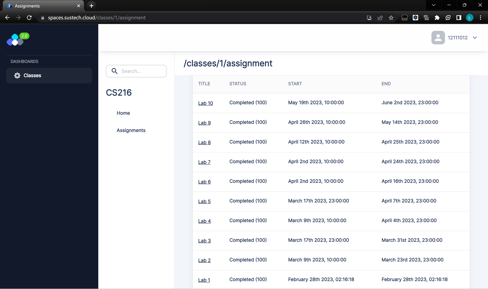
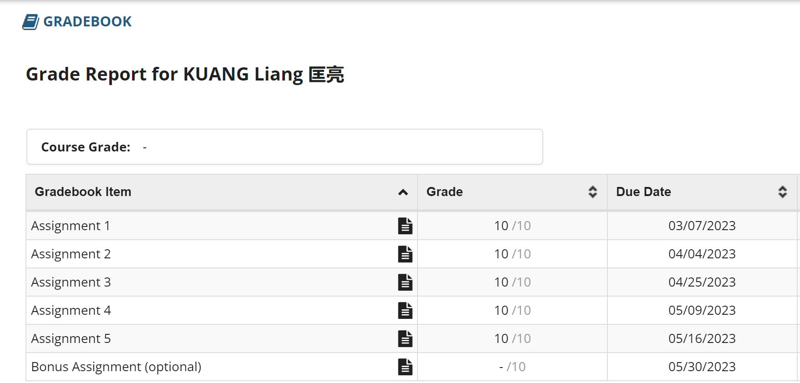

# Algorithm-Lab
SUSTech 2023 Spring CS216 Algorithm Design and Analysis(H)

~~本来是英文的，但我英文太差还是不要恶心自己和大家了~~

南方科技大学 2023 春季 CS216 算法设计与分析(H)

备份了所有 Lab problems 和 Assignments 以及对应的我完成的内容

**一定不要**将其中的任何内容作为你自己的作业来提交，否则自负查重风险

完成情况：

期末考试 96 ，总评 98
